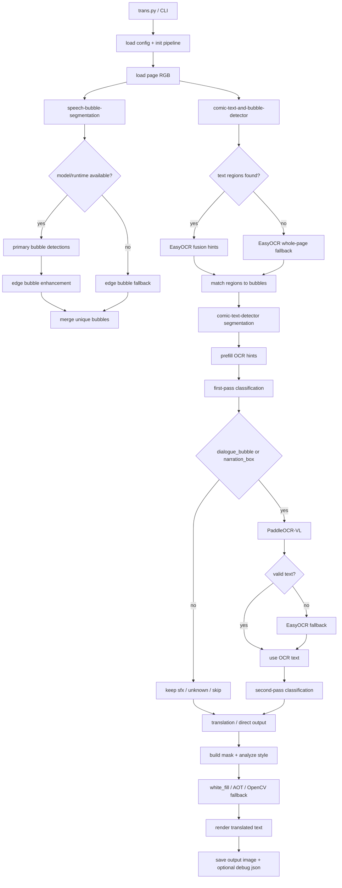

# Manga Translator Pipeline Flow

```mermaid
flowchart TD
    A["trans.py / CLI"] --> B["load config + init pipeline"]
    B --> C["load page RGB"]

    C --> D["speech-bubble-segmentation"]
    D --> E{"model/runtime available?"}
    E -- yes --> F["primary bubble detections"]
    E -- no --> G["edge bubble fallback"]
    F --> H["edge bubble enhancement"]
    H --> I["merge unique bubbles"]
    G --> I

    C --> J["comic-text-and-bubble-detector"]
    J --> K{"text regions found?"}
    K -- yes --> L["EasyOCR fusion hints"]
    K -- no --> M["EasyOCR whole-page fallback"]
    L --> N["match regions to bubbles"]
    M --> N

    N --> O["comic-text-detector segmentation"]
    O --> P["prefill OCR hints"]
    P --> Q["first-pass classification"]

    Q --> R{"dialogue_bubble or narration_box"}
    R -- yes --> S["PaddleOCR-VL"]
    S --> T{"valid text?"}
    T -- no --> U["EasyOCR fallback"]
    T -- yes --> V["use OCR text"]
    U --> V
    R -- no --> W["keep sfx / unknown / skip"]

    V --> X["second-pass classification"]
    W --> Y["translation / direct output"]
    X --> Y

    Y --> Z["build mask + analyze style"]
    Z --> ZA["white_fill / AOT / OpenCV fallback"]
    ZA --> ZB["render translated text"]
    ZB --> ZC["save output image + optional debug json"]
```
